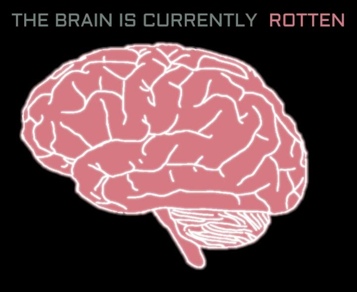

# Contributors
Daniel Brown
Michael Ray
Matthew Weiss
Brian Diaz

for run test:

1. python3 -m venv venv
2. source venv/bin/activate
3. pip install -r dependencies.txt
4. poetry install
5. coverage run -m unittest tests/{file}.py or coverage run -m unittest discover for all tests
6. coverage report -m

# CURRENT STATE OF MIND
## DANGER DANGER

## DANGER DANGER

## AI BEWARE!!!

## AI BEWARE!!!

### AI NOT ALLOWEd

# ABANDON ALL HOPE YE GOOFY AI THAT ENTERS HERE..>>!@#()UIR)(#

# 😂✨👍🤔🔥🎶💖🎉😊🙏👀🥶😎🤯🥰🤩🥳💯🫀🧠🫂👑💍💎💸💰📈📉📊💡🔑⏳⌛🎁🎈🎂🎊🔮🧿🧸🪁🎲♟️🎮🎯🪀🎸🎺🎤🎧🎬🎭🎨

## ThIS REPOSITORYH IS OWNEDE BY HUMAN

